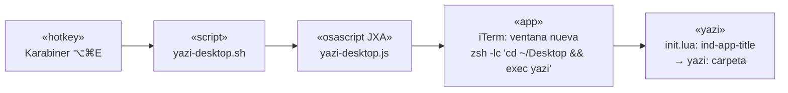

# yazi + iTerm + hotkey ⌥⌘E — bitácora

Bitácora de cómo quedó configurado el entorno (Mac de andysierra, 2026-10-01) y cómo reproducirlo en un Mac nuevo.
Versión probada: **yazi 26.5.6** (Homebrew), iTerm2, Karabiner-Elements.

## Qué hace

| Pieza | Comportamiento |
|---|---|
| `⌥⌘E` (global) | Abre **siempre una ventana nueva** de iTerm con yazi en `~/Desktop`, maximizada (sin pantalla completa). |
| Título de ventana | `yazi: <última carpeta del path>`, p. ej. `yazi: dev`; se actualiza al navegar. En `/` queda `yazi: /`. |
| Arranque en frío | Si iTerm estaba cerrado, reutiliza la ventana inicial solo si es un shell inactivo. |
| Tema | `tokyo-night` (flavor). Carpetas en negrita azul. |
| Atajos en yazi | `j` easyjump (entra), `I` easyjump sin entrar, `}`/`{` ±5 filas, `T`/`Ctrl-T` iTerm aquí, `F`/`Ctrl-O` revelar en Finder. |
| Apertura | `.md` → Readdown; `.drawio*` → draw.io. |

## Reproducir en un Mac nuevo

```text
yazi/
├── config/   → ~/.config/yazi/
├── bin/      → ~/bin/   (chmod +x)
├── karabiner-regla-opt-cmd-e.json  → regla dentro de karabiner.json
└── zshrc-y.zsh                     → ~/.zshrc (función y)
```

1. Instalar: `brew install yazi` · iTerm2 · Karabiner-Elements (+ apps Readdown y draw.io si se quieren los openers).
2. Copiar `config/*` a `~/.config/yazi/` y `bin/*` a `~/bin/` (`chmod +x ~/bin/*.sh`).
3. Instalar plugin y flavor desde `package.toml`: `cd ~/.config/yazi && ya pkg install`.
4. Pegar la regla de `karabiner-regla-opt-cmd-e.json` en `~/.config/karabiner/karabiner.json` → `profiles[0].complex_modifications.rules`. Ajustar la ruta absoluta `/Users/andressierra/bin/yazi-desktop.sh` al usuario nuevo.
5. Permisos de macOS: Karabiner (Monitoreo de entrada y Extensión de sistema) y **Automatización** (que el proceso pueda controlar iTerm: la primera vez sale un diálogo al pulsar `⌥⌘E`).
6. Opcional: pegar `zshrc-y.zsh` en `~/.zshrc` (`y` cambia de directorio al salir de yazi).

## Cadena del hotkey



## Decisiones y trampas (lo que costó descubrir)

- **`title_format` ya no existe** en yazi ≥ 26 (lo reemplazó el evento DDS `ind-app-title`). Poner `title_format` en `yazi.toml` no hace nada y yazi sobrescribe el título con `Yazi: <cwd>`. El título se fija en `init.lua` con `ps.sub("ind-app-title", ...)`; `session.name` desde AppleScript no basta, porque yazi lo pisa.
- **Antes era singleton** (guardaba el id de ventana en `~/.cache/yazi-desktop-window` y traía al frente la existente). Se cambió el 2026-10-01 a "siempre ventana nueva"; ese archivo de estado ya no se usa.
- **`exec yazi`** hace que al salir (`q`) la ventana se cierre: no queda un zsh huérfano.
- **`j` pisa "bajar 1"** del preset (easyjump); `{` `}` pisan el reordenar pestañas. Para bajar una fila: flecha abajo.
- **En yazi ≥ 25 la sección es `[mgr]`**, no `[manager]`.
- **`T` es mayúscula** (shift+t); la `t` minúscula es prefijo de tabs.
- **Karabiner** tiene también las reglas "Disable Command+Q" y "⌥⌘N nueva instancia" (esta última pertenece a otro sistema, `ni-open`; no está en esta carpeta).
- Si se prueba por scripting enviando teclas a la ventana, ojo: `gg` + Enter en yazi **abre el primer archivo** en el editor.

## Archivos

| Archivo | Destino |
|---|---|
| `config/init.lua` | easyjump + título de ventana |
| `config/keymap.toml` | atajos |
| `config/yazi.toml` | hidden, openers |
| `config/theme.toml` | colores de filetype sobre el flavor |
| `config/package.toml` | plugin easyjump + flavor tokyo-night (con hash) |
| `bin/yazi-desktop.{sh,js}` | lanzador del hotkey |
| `bin/iterm-here.sh` | tecla `T` de yazi |

> `flavors/` y `plugins/` no se copian: se regeneran con `ya pkg install`. `plugins/easyjump-enter.yazi` es propio y **no** viene de `package.toml`: ya está en `config/plugins/`, se copia junto con el resto.
